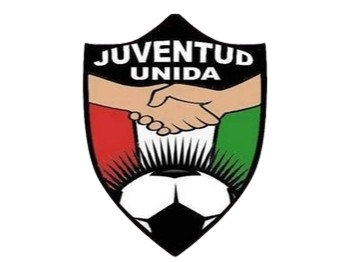
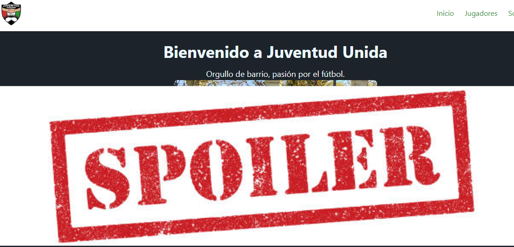

# ⚽ Juventud Unida - Web del Club

¡Bienvenidos a la web oficial de **Juventud Unida**, el club de barrio hecho con pasión, dedicación y mucho fútbol!  
Este proyecto representa no solo a un equipo, sino a una comunidad que vive el deporte como forma de vida.

---

## 🌐 ¿De qué se trata?

Una página web desarrollada con **React + TailwindCSS** para presentar a nuestro querido club de barrio.  
Desde los jugadores hasta el fixture de los partidos, la web busca ser un espacio informativo y visualmente atractivo para los vecinos, hinchas y jugadores.

---

## ✨ Funcionalidades

- 🧭 Navegación SPA con React Router.
- 🧍‍♂️ Página con lista de jugadores y sus dorsales.
- 📆 Fixture para seguir el calendario de partidos.
- 🖼️ Carrusel con fotos del equipo.
- 📱 Responsive: adaptado para móviles y pantallas grandes.
- 🎨 Paleta de colores personalizada para representar los colores del club.

---

## 🛠️ Tecnologías usadas

- **React**
- **Tailwind CSS**
- **Vite**
- React Router DOM
- Deploy en **Vercel**

---

## 📸 Capturas

  

